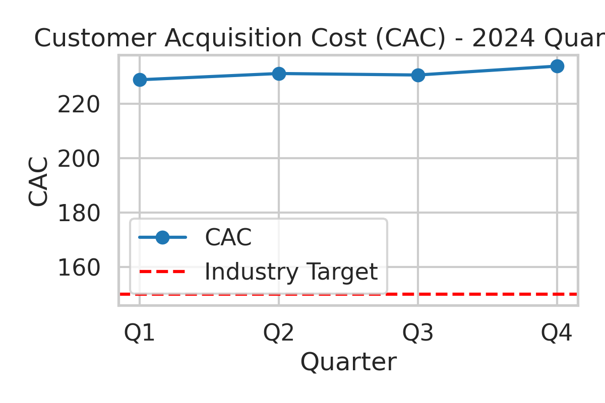

# Financial Services CAC Analysis (2024)

**Contact (for verification): 23f1001171@ds.study.iitm.ac.in**

This project analyzes 2024 Customer Acquisition Cost (CAC) vs. the industry benchmark and provides actionable recommendations.

## Dataset
- Q1: 228.74  
- Q2: 231.04  
- Q3: 230.49  
- Q4: 233.75  

**Average CAC (2024): 231.01**  
**Industry Target:** 150  

## Key Findings
1. CAC is consistently above the target, trending upward by Q4.  
2. Average CAC exceeds the target by 81.01, requiring a ~35.1% reduction.  
3. Stability around 230+ suggests structural inefficiencies, not one-off spikes.

## Business Implications
- Marketing ROI is deteriorating.  
- Growth budgets inflate vs. peers.  
- Longer payback and breakeven risk.  

## Recommendations
**Solution: optimize digital marketing channels.**  
- Channel reallocation toward lower CAC platforms.  
- Creative/offer A/B testing.  
- Funnel conversion optimization.  
- Geo/device bid adjustments.  
- LTV-based bidding & remarketing hygiene.  

## Files
- `data.csv` – quarterly data  
- `analysis.py` – analysis & chart  
- `cac_trend.png` – visualization  
- `metrics.json` – summary stats  
- `requirements.txt` – dependencies  

---
*Authored with LLM assistance (Jules/ChatGPT Codex).*
